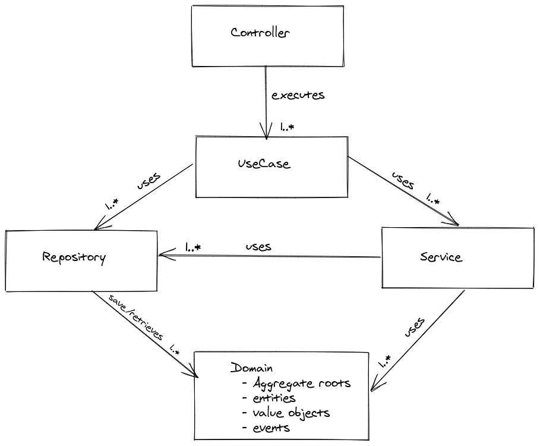

# Pragmatic
An opinionated  Maven archetype to quickly bootstrap backend API on a sane basis.
Pragmatic is in the early phase of development and is not production ready. 
Contributions are welcomed.

# How to use
1. Clone the project: `git clone git@github.com:salmanebah/pragmatic-archetype.git`
2. Install locally: `mvn install`
3. Generate a project:  `cd directory/where/to/generate` and `mvn archetype:generate -DarchetypeCatalog=local` 
4. Follow the instructions to complete the generation.

## Architecture

## Philosophy
- Only use frameworks and libraries when really needed: `Java SE > JSR > Spring framework > other libraries`
- Prefer programmatic Spring setup to their annotation-driven counterpart (exception in `Controller`, `Request` and `Response` objects)
- Strive for rich domains and avoid anemic domains at all cost
- Avoid Mapping frameworks
- Restrict usage of mocking frameworks to the minimum. If possible use an in-memory version of the SUT collaborators.
- Keep [these principles](https://github.com/KentBeck/TestDesiderata/blob/master/index.md) when writing tests

## Frameworks and Technologies
`Pragmatic` is based on:
 - [Spring Boot](https://spring.io/projects/spring-boot) web framework 
 - [Jooq](https://www.jooq.org/) for the Database access
 - [Flyway](https://flywaydb.org/) for database migration
 - [Test containers](https://www.testcontainers.org/) for integration tests
 - [ArchUnit](https://www.archunit.org/) for architecture level tests
 - [Docker](https://www.docker.com/) and [Docker Compose](https://docs.docker.com/compose/) for local development
## Directory structure
- `domain` should contain all the `entities`, `value objects`, `aggregate roots` and domain `events`

- `usecase` should contain all the system use cases. 
A use case can be defined as a complete interaction between a user and the system.

- `repository` should contain all the persistent components that access the datasource. 
Repositories should deal with `entities` or `aggregate roots`.

- `service` should contain [domain and application services](https://enterprisecraftsmanship.com/posts/domain-vs-application-services/). 

- `task` should contain asynchronous and scheduled jobs. A task should be `Runnable` or `Callable` and
must be configured in a Spring Configuration class (i.e without using the `@Scheduled` annotation).

- `rest` should contain the API controllers, requests, responses and mappers.

- `configuration` should contain all the spring configuration related classes. 
Spring Beans must be created explicitly (i.e without `@Repository`, `@Service`, ... stereotypes)

## Goodies out of the box
- i18n-ready API error messages and default messages for common errors
- Swagger documentation under `/api-doc` and `/swagger` for all controllers
- A docker and docker compose environment for local development 
- Monitoring with [Actuator](https://docs.spring.io/spring-boot/docs/current/reference/html/production-ready-features.html) available at `/actuator`, 
 [Prometheus](https://prometheus.io/) on port `9090` and [Grafana](https://grafana.com/) on port `3000` (default admin password is **!changeMe!**)
- A Github pipeline to run unit and integration tests upon pull request and merge on the `master` branch

## Common commands
- `mvn generate-sources -Pjooq` to generate jooq classes from migration files
- `mvn test` to only execute unit tests
- `mvn verify -Pit` to only execute integration tests
- `mvn verify` to execute all the tests
- `docker-compose up` to run the application and all the dependencies